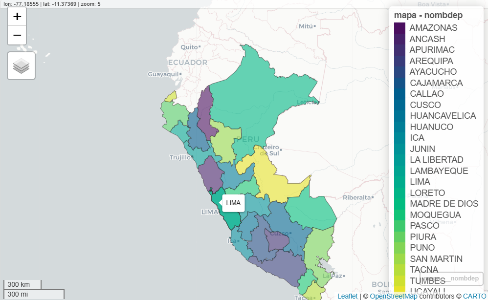

Este es un tutorial sobre como hacer un mapa del calor del Perú.

Primero comenzamos buscando el archivo de los límites departamentales del Perú en formato Shapefile (.shp), este archivo se puede encontrar y descargar en la Plataforma de información territorial de la Secretaría de Demarcación y Organización Territorial del Perú: https://geosdot.servicios.gob.pe/visor/

1) Iniciamos cargando las librerías que necesitaremos

```{r}
library(plotly)
library(sf)        # manejar shapefiles
library(ggplot2)   # graficar
library(dplyr)     # manipulación de datos
library(tidyverse)
```
Hay muchas formas de crear un mapa del calor
```{r}
mapa <- st_read("C:/Users/yonns/Downloads/v_departamentos_2023_01052026/v_departamentos_2023.shp")
names(mapa)
mapview(mapa, zcol = "nombdep"
```
Dándonos un mapa interactivo


Ahora veremos como crar un mapa del Perú utilizando los resultados al 98% de las elecciones generales 2026 del Perú, se hará sobre ganador por departamento.

Utilizamos las librerías anteriormente mencionadas e importamos el archivo shapefile junto al archivo con los resultados a mostrar.

```{r}
mapa <- st_read("C:/Users/yonns/Downloads/v_departamentos_2023_01052026/v_departamentos_2023.shp")
datos_elecciones <- read.csv("C:/Users/yonns/Downloads/resultadonpe222.csv", sep = ";",      
                             encoding = "UTF-8")

if(ncol(datos_elecciones) == 1) {datos_elecciones <- read.csv2("C:/Users/yonns/Downloads/resultadonpe222.csv", encoding = "UTF-8")}
```

Realizamos una limpieza radical de nombres (Mayúsculas, sin tildes, sin espacios), también nos aseguramos de que no ocurran confusiones con algunos signos como el porcentaje (%)
```{r}
datos_elecciones <- datos_elecciones %>% 
  mutate(DEPARTAMENTO = trimws(toupper(iconv(DEPARTAMENTO, to = "ASCII//TRANSLIT"))))
peru_sh <- mapa %>% 
  mutate(nombdep = trimws(toupper(iconv(nombdep, to = "ASCII//TRANSLIT"))))
datos_elecciones <- datos_elecciones %>%
  mutate(PORCENTAJE = as.numeric(gsub("%", "", PORCENTAJE)))
glimpse(datos_elecciones$PORCENTAJE)
mapa_final <- peru_sh %>%
  left_join(datos_elecciones, by = c("nombdep" = "DEPARTAMENTO"))
```
Reordenamos a los candidatos por porccentaje (de mayor a menor), así se ordenarán automáticamente al momento de realizar la leyenda.
```{r}
mapa_final <- mapa_final %>%
  mutate(CANDIDATO = reorder(CANDIDATO, -PORCENTAJE, FUN = mean, na.rm = TRUE))
```
Asignamos colores, el nombre debe coincidir con el de la base de datos.
```{r}
mis_colores <- c(
  "KEIKO SOFIA FUJIMORI HIGUCHI"   = "orange",
  "RAFAEL BERNARDO LÓPEZ ALIAGA CAZORLA" = "#34c3eb",
  "ROBERTO HELBERT SANCHEZ PALOMINO"   = "red",
  "JORGE NIETO MONTESINOS" = "yellow",
  "RICARDO PABLO BELMONT CASSINELLI" = "green"
)
```

Finalmente, creamos el mapa
```{r}
ggplot(mapa_final) +
  geom_sf(aes(fill = CANDIDATO), color = "black", size = 0.2) +
  
  scale_fill_manual(values = mis_colores) + 
  
  labs(
    title = "ELECCIONES GENERALES 2026:\nGANADORES POR DEPARTAMENTO",
    caption = "Fuente: ONPE 2026",
    fill = "Candidatos"
  ) +
  theme_void() + 
  theme(
    plot.title = element_text(face = "bold", size = 16, hjust = 0.5, color = "darkblue"),
    plot.caption = element_text(size = 8, hjust = 1),
    legend.position = "right"
  )
```
